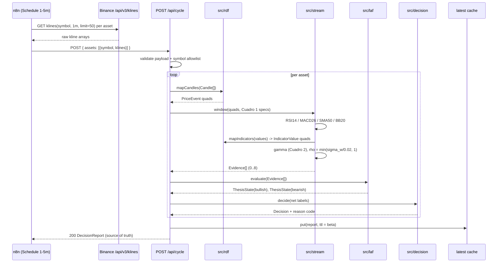
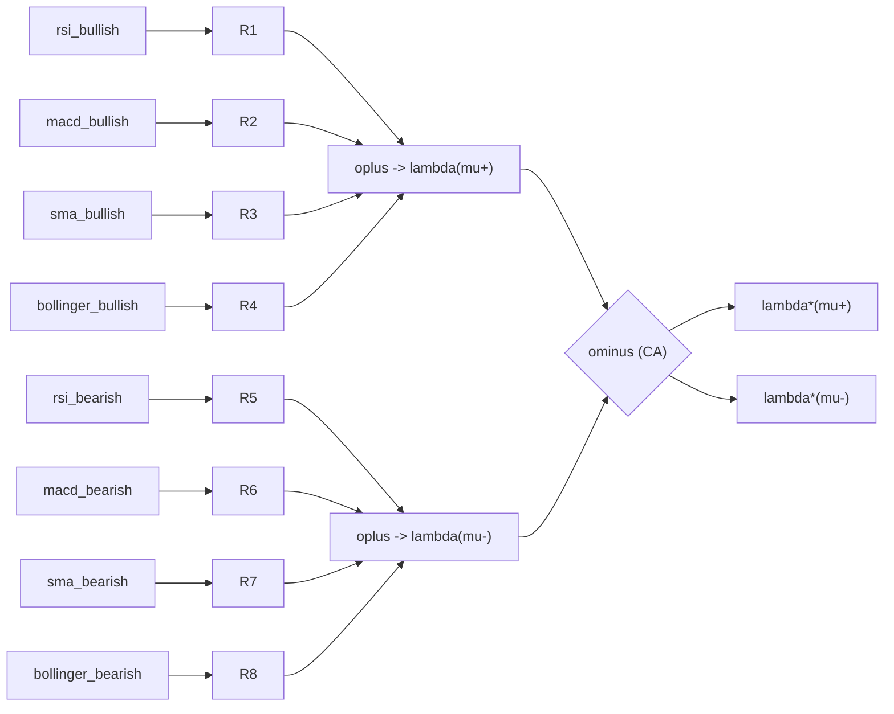

# Design: FAF Platform — Explainable Streaming Financial Recommendations

## Technical Approach

One Next.js (App Router, TypeScript) app. Each layer of the paper's Figure 1 is one module exposing **one pure function** whose input and output are plain values — mirroring the paper's stream-in/stream-out rule ("ninguna capa opera sobre datos estáticos acumulados", §3.1). The only impure edges are the Binance HTTP adapter and the two route handlers.

```
Candle[] ──L1──▶ RDF quads ──L2──▶ Evidence[] ──L3──▶ ThesisState×2 ──L4──▶ Decision
```

`runCycle(rawKlines) → DecisionReport` is a deterministic composition of those four functions; the same input always yields the same report, which is what makes zero persistence sound (§5 traceability) and makes every layer table-testable.

## Module Structure (greenfield)

| Path | Layer | Responsibility |
|---|---|---|
| `src/domain/types.ts` | — | Shared value types (`Candle`, `Label`, `Evidence`, `Argument`, `Decision`). No imports. |
| `src/rdf/ontology.ts` | L1 | `faf:` namespace terms, IRI minting (`faf:event_{asset}_{kind}_{t}`). |
| `src/rdf/mapCandles.ts` | L1 | `Candle[] → Quad[]` (`faf:PriceEvent`, OHLCV, `faf:asset`, `faf:timestamp`). |
| `src/rdf/mapIndicators.ts` | L1 | Indicator scalars → `faf:IndicatorValue` quads (`faf:rsiValue`, `faf:macdHistogram`, `faf:sma20/50`, `faf:bollingerUpper/Lower`). |
| `src/rdf/store.ts` | L1 | Per-cycle `N3.Store` factory + Turtle serialization for the trace. |
| `src/stream/window.ts` | L2 | S2R operator: `W(S, ω, β)` over the quad stream → window content + `WindowSpec`. |
| `src/stream/indicators/{rsi,macd,sma,bollinger}.ts` | L2 | Cuadro 1 math (Wilder RSI, EMA 12/26/9 MACD, SMA 20/50, BB 20±2σ). |
| `src/stream/confidence.ts` | L2 | Cuadro 2 γ formulas, one per predicate. |
| `src/stream/risk.ts` | L2 | eq. (1)(2): returns, σ_ω, `ρ = min(σ_ω/0.02, 1)`. |
| `src/stream/evidence.ts` | L2 | R2S operator: active conditions → `Evidence[]`. |
| `src/laf/rules.ts` | L3 | R1–R8 table (predicate → thesis), fixed `λ(Ri)=⟨1,0⟩`. |
| `src/laf/algebra.ts` | L3 | `otimes`, `oplus`, `ominus` (eq. 4–6). |
| `src/laf/graph.ts` | L3 | Builds and evaluates the argument graph → `ThesisState` pair. |
| `src/decision/policy.ts` | L4 | eq. (10)(11): σ, θ=0.67, δ=0.20, three-way no-recommendation. |
| `src/market/provider.ts` / `binance.ts` | edge | `MarketDataSource` interface + Binance klines adapter. |
| `src/cycle/runCycle.ts` | — | Pure L1→L4 composition + trace assembly. |
| `src/cycle/latest.ts` | — | Module-scope best-effort cache (presentation only, see §5). |
| `app/api/cycle/route.ts` | edge | `POST` — n8n trigger; computes and returns `DecisionReport`. |
| `app/api/decisions/route.ts` | edge | `GET` — UI read; cache hit or on-demand recompute. |
| `app/(dashboard)/page.tsx` + `components/` | UI | Minimal table view (decision, both theses, evidence trace). |
| `n8n/faf-workflow.json` | infra | Exported workflow. |
| `tests/fixtures/binance/*.json`, `tests/golden/paper-example.test.ts` | test | Cassettes + §3 golden. |

## Sequence Diagram (a) — Full Cycle



## Sequence Diagram (b) — Label Algebra for One Window

Fixed topology (Budán Fig. 5(a)): 8 evidence leaves → 2 RA aggregation groups → 1 CA conflict. Acyclic, so direct ⊗→⊕→⊖ evaluation replaces the general solver (Budán Alg. 1).



```mermaid
sequenceDiagram
    participant G as laf/graph
    participant A as laf/algebra
    G->>A: otimes(evidence.label, <1,0>) per active evidence
    A-->>G: argument label == evidence label (transparent)
    G->>A: oplus(supporters+) / oplus(supporters-)  (mean; empty set -> <0,0>)
    A-->>G: lambda(mu+), lambda(mu-)
    G->>A: ominus(lambda(mu+), lambda(mu-)) and its mirror
    A-->>G: lambda*(mu+), lambda*(mu-)
```

## Architecture Decisions

### Decision: RSP-QL semantics in TypeScript, not an RSP-QL interpreter

**Choice**: hand-built sliding-window engine over real RDF quads (N3.js), implementing RSP-QL's operator triad rather than its query grammar.
**Alternatives rejected**: (B) minimal RSP-QL parser + Comunica per snapshot; (C) plain arrays, no RDF at all.
**Rationale — the defense argument**:

1. **The paper's own requirement is semantic, not syntactic.** §3.3 justifies windowing because it "es el único [paradigma] que permite calcular correctamente indicadores que dependen de un número fijo de observaciones anteriores", and requires that "ω debe alinearse exactamente con la cantidad de períodos que el indicador necesita". `W(S,ω,β)` is defined in §2.1 as a temporally bounded subset with range ω and step β — a *content and lifetime* guarantee. Our engine reproduces exactly that: 50 fresh candles per cycle, each indicator reading exactly its ω window, β = 1 candle re-evaluation.
2. **RSP-QL is itself defined as a semantics.** The cited source [12] is *"RSP-QL semantics: a unifying query model"* — its contribution is the S2R (window) → R2R (evaluation) → R2S (streaming output) model, not a grammar. Our modules map 1:1: `stream/window.ts` = S2R, `stream/indicators+confidence` = R2R over the window content, `stream/evidence.ts` = R2S (Rstream). Fidelity is claimed at the level RSP-QL actually defines.
3. **Non-monotonicity is preserved structurally.** Per §3.3, evidence validity "está estructuralmente acotada por el ciclo de vida de la ventana, sin requerir ningún mecanismo explícito de expiración". Because each cycle rebuilds from scratch, a lapsed condition simply is not re-emitted — retraction by construction, exactly the paper's semantics.
4. **The RDF boundary is real, not decorative.** L1 emits genuine `faf:PriceEvent`/`faf:IndicatorValue` quads in an `N3.Store`; L2 consumes quads. Interoperability and the traceable IRI chain (§5) survive intact.

**What is lost by not writing an interpreter**: the ability to *register new queries at runtime* by writing RSP-QL text, and executable proof of SPARQL-algebra conformance (`FILTER`, joins, projections) over window snapshots.
**Why acceptable**: FAF's query set is closed and fixed — 8 predicates over 4 window configurations, each a single-triple-pattern `FILTER` with no joins. A general SPARQL evaluator would be dead weight over that shape, and building one is a research project in itself (exploration gap 1). The RSP-QL text from §3.3 is preserved verbatim as a doc comment above each predicate's implementation, giving reviewers a line-by-line syntax↔code correspondence without an interpreter. If runtime-registrable queries ever become a requirement, `stream/window.ts`'s S2R boundary is the single seam where Comunica would drop in.

### Decision: per-cycle execution model — synchronous response is the source of truth

**Choice**: n8n `POST /api/cycle` computes synchronously and **returns the full `DecisionReport` in the HTTP response**. That response is the authoritative artifact for the cycle. `GET /api/decisions` serves the UI: it returns a best-effort module-scope cached report if one exists and is younger than β, otherwise it **recomputes on demand** by pulling klines itself through `MarketDataSource`.
**Alternatives rejected**: (i) fire-and-forget job + polled store (needs durable state, contradicts the zero-persistence claim); (ii) cache-only reads (a cold Vercel lambda would show an empty dashboard).
**Rationale**: correctness never depends on the cache — because `runCycle` is pure and Binance re-serves history, a cache miss recomputes an *identical* report. The cache is therefore presentation latency optimization, not reasoning state; the reasoning core reads it never. This satisfies "no process, file, or external store retains reasoning state between cycles" literally: no cross-invocation state is *load-bearing*.

**Cache sharing in the stated Vercel deployment (precise framing)**: `src/cycle/latest.ts`'s cache is a plain module-scope variable, so it is only actually shared between `POST /api/cycle` and `GET /api/decisions` when both invocations execute inside the *same* running Node.js process with the *same* loaded module instance. On this project's stated production target — Vercel serverless (`runtime='nodejs'`, `dynamic='force-dynamic'`, `maxDuration=60`) — that condition is **not reliably true even outside local dev**: `POST /api/cycle` and `GET /api/decisions` are two separate route handlers that Vercel is free to schedule as **separate serverless function instances** (separate cold starts, separate module registries), independent of whether the deployment is `next dev` or a production build. Framing this as a "dev-mode-only" quirk understates the real production behavior. Practically: most `GET /api/decisions` calls on Vercel will likely **miss** the cache and trigger a fresh live Binance fetch, even moments after n8n's `POST /api/cycle` already computed and cached an identical report in a different instance. This is **not a correctness bug** — `runCycle` is pure, so a cache miss always recomputes a byte-identical report for the same underlying candles (`tests/api/decisions.test.ts` proves cache-hit output equals cache-miss-recompute output) — but it is a **latency/API-call-cost** cost: the cache mostly fails to deliver the presentation-latency optimization it was originally introduced for. No behavior change is warranted by this alone (adding Redis/Upstash/any external store would reopen the "Layer 3 stays in-memory, no external store" decision); if dashboard latency or Binance rate-limit exposure becomes a real concern, an external KV cache or Vercel function-consolidation options are the candidates to revisit, not a correctness fix.

### Decision: one ingestion route, two data sources

**Choice**: `POST /api/cycle` accepts either an n8n-pushed raw klines payload (`PushedKlinesSource`) or an empty body (`BinanceHttpSource` pulls server-side). Same `MarketDataSource` interface, same downstream pipeline.
**Rationale**: honors D2 (n8n fetches raw) while enabling the UI's on-demand read path and offline fixture-driven tests.

### Other decisions

| Topic | Choice | Rejected | Rationale |
|---|---|---|---|
| RDF library | **N3.js only** (`Store`, `DataFactory`, `Writer`) | rdf-ext; both together | N3.js is RDF/JS-compliant, zero-dep, has the store + Turtle writer we need; mixing two term factories risks non-interoperable terms for no gain. |
| Indicator math | **hand-rolled**, one file per indicator | `technicalindicators` npm | Traceability is the deliverable: Wilder vs. simple RSI smoothing and EMA seeding must be visible and cited, not hidden behind a library default. Each file gets a `// FAF Cuadro 1/2` reference and is verified against published reference vectors. |
| Test runner | **Vitest** | Jest | Native ESM/TS, fast, works with Next.js; fills `rules.apply.test_command`. |
| n8n workflow | Schedule Trigger → HTTP Request (klines, one per asset, `limit=50`) → Aggregate → HTTP Request `POST /api/cycle` (+ shared-secret header) | Code nodes doing RDF | Keeps n8n at cron+fetch (D2); no untestable logic in n8n. |
| Deployment | Vercel, `runtime='nodejs'`, `dynamic='force-dynamic'`, `maxDuration=60` | long-lived Node process | Compute is trivial (O(50) per indicator, microseconds); wall clock is network-bound — N assets fetched in parallel (concurrency cap 5) ≈ 1–2 s for N ≤ 10. Comfortably inside the limit and the 1-min cadence. Beyond N=10, stagger assets across cycles (rollback ladder step 1). |

### Deviation D5 (post-hoc, discovered in PR2 review): MACD's RSP-QL window widened from Cuadro 1's literal 26 to 50

**What Cuadro 1 says**: MACD's window is "26 velas (período lento)" — `omega=26`, `beta=1`, matching the indicator's own `slowPeriod=26`.

**What the code does now**: `src/stream/evidence.ts`'s `MACD_SPEC` uses `omega=50` (same window range as `SMA_SPEC`, the system's already-established uniform per-cycle kline fetch size). `computeMACD`'s own `fastPeriod=12`/`slowPeriod=26`/`signalPeriod=9` — the indicator formula Cuadro 1 actually defines — are **unchanged**; only the RSP-QL window RANGE the caller draws candles from changed.

**Why (the bug this fixes)**: `window()` (S2R operator) hands `computeMACD` exactly `omega` closes. At the literal `omega=26`, `computeEMASeries(closes, 26)`'s recursive step (`for (i = period; i < values.length; i++)`) never executes because `26 < 26` is false — the slow-EMA series has length 1 (just its seed). The MACD-line series derived from it therefore also has length 1, so `effectiveSignalPeriod = min(9, 1) = 1`, the signal EMA over that single point equals the point itself, `histogram = macdLine - signal = 0`, and `sigma_H = populationStdDev([one value]) = 0` — **always**, independent of real market data. `src/stream/confidence.ts`'s `sigma_H===0` guard correctly avoids a `NaN` (returns confidence 0), but `src/stream/evidence.ts`'s activation check (`histogram > 0` / `histogram < 0`) can then never be true, so `macd_bullish`/`macd_bearish` (rules R2/R6) were permanently unreachable at runtime — a silent, structural bug rather than a documented indicator-inactive edge case.

**Why 50 (not, say, 27)**: 50 matches the window range the system already fetches uniformly per cycle (SMA's own Cuadro-1 window is 50, the largest of the four indicators — n8n/Binance already pull `limit=50` klines per asset). Reusing that existing size avoids introducing a fifth distinct window range and gives the EMA(26)/EMA(9) chain 24 extra candles of history, enough for the slow-EMA and signal-EMA recursive steps to actually run and produce a non-degenerate, multi-point series.

**Verification**: `tests/stream/evidence.test.ts` (`describe('DEVIATION D5 ...')`) proves both directions — `macd_bullish`/`macd_bearish` can now activate with `histogram !== 0`, `sigma_H > 0`, and real (0,1] confidence, and `sufficientHistory` is correctly `false` for 26–49 candles (MACD's own cold-start floor moved from 26 to 50 along with the window).

**Addendum (discovered while deriving the task 6.1 Golden #1 fixture)**: because `MACD_SPEC.omega` now equals `SMA_SPEC.omega` (both 50), `window()` returns the IDENTICAL last-50-candle close array for both indicators whenever `evidence.ts` evaluates them in the same cycle. `computeSigmaOmega(closes)` is a pure function of that array, so **MACD's and SMA's evidence `rho` are now always numerically identical** for any single cycle — reproducing the paper's own §3 example values `macd_bullish<0.80,0.10>` and `sma_bearish<0.15,0.30>` (different rho) simultaneously through the real pipeline is therefore architecturally impossible post-D5. `tests/fixtures/paper-example/README.md` derives and verifies a replacement: use a single shared `rho=0.50` for both the MACD and SMA evidence instead of the paper's 0.10/0.30 split. This is algebraically proven (and numerically confirmed to `1e-15`) to still reproduce the paper's exact final decision output (`lambda*(mu+)=<0.50,0.00>`, `sigma+=0.75`, `sigma-=0.475`, `gap=0.275` → BUY) — only the two individual evidence labels differ from the paper's literal numbers, not the decision the framework reaches. No further code change is required; this is a fixture-derivation consequence of D5, not a new implementation bug.

### Deviation D6 (post-hoc, discovered in post-PR3 deep scrutiny): RSI's RSP-QL window widened from Cuadro 1's literal 14 to 20

**What Cuadro 1 says**: RSI's window is "14 velas" — `omega=14`, `beta=1`, exactly matching the indicator's own defining period, `period=14` (Wilder, 1978).

**What the code does now**: `src/stream/evidence.ts`'s `RSI_SPEC` uses `omega=20`, and the call site passes `computeRSI(rsiWindow.closes, 14)` — `period=14` EXPLICIT, RSI's own Cuadro-1-defining period, **unchanged**. Only the RSP-QL window RANGE the caller draws candles from changed, exactly mirroring D5's pattern for MACD.

**Why (the bug this fixes)**: `window()` (S2R operator) hands `computeRSI` exactly `omega` closes. At the literal `omega=14`, `computeRSI(closes)` (the old call site omitted `period`) builds `diffs.length = closes.length - 1 = 13` differences, and `period` defaults to `diffs.length = 13`. Wilder's continuation loop (`for (i = period; i < diffs.length; i++)`) therefore never executes (`13 < 13` is false) — the function always returned the SEED step's plain average of all 13 diffs, never Wilder's (1978) genuine recursive smoothing that `rsi.ts`'s own doc comment cites. This is the same shape of bug as D5 (a Cuadro-1 window that exactly equals the indicator's own period leaves no candles for the recursive step to consume), just silent rather than fully inert: RSI still produced a real, in-range number every cycle (unlike D5's `histogram`/`sigma_H` which were hard-zero), so it was not caught by an activation-never-fires test — only by re-deriving the Golden #1 fixture and noticing the RSI computation path never took its `for` loop branch.

**Why 20, not 50 (the MACD/SMA D5 window size) — the key design decision**: 50 was the first candidate tried, since it would mirror D5 exactly and reuse the system's already-uniform 50-candle per-cycle kline fetch. It was rejected after hand-verifying a real structural consequence: if `RSI_SPEC.omega` equalled `MACD_SPEC.omega` and `SMA_SPEC.omega` (both already 50 per D5), `window()` would return the IDENTICAL last-50-candle close array for **all three** indicators in the same cycle — not just MACD and SMA, as D5's addendum already documents, but RSI too. `computeSigmaOmega(closes)` is a pure function of that array, so RSI, MACD, and SMA evidence would ALWAYS carry the exact same `rho` value R, for **any** real market data, not just this fixture — this is a property of the shared window, not an artifact of a specific candle series.

Trace the consequence through the algebra (paper eq. 5-6, `src/laf/algebra.ts`): consider any cycle where the bullish thesis's supporters include `rsi_bullish` and `macd_bullish` (both `rho=R`), and the bearish thesis's supporter is `sma_bearish` (also `rho=R`, since it shares the window too). `lambda(mu+).rho = oplus([R, R]).rho = R` (mean of R and R is R). `lambda(mu-).rho = R` directly (single supporter). Then `ominus`'s rho component for the losing side is `max(0, lambda(mu-).rho - lambda(mu+).rho) = max(0, R - R) = 0`, **for any value of R whatsoever** — not a small residual, an exact algebraic zero forced by construction. This structurally deadens the risk (`rho`) dimension of the paper's conflict-resolution operator (⊖) in every cycle where RSI/MACD-side evidence conflicts with SMA-side evidence (or any cross-indicator conflict spanning a shared window) — a real behavioral degradation of the framework's risk-differentiation capability, not just a fixture-derivation inconvenience like D5's addendum. This was verified by hand for the Golden #1 scenario before being rejected: an earlier attempt at this exact fix (never committed) used `omega=50` and reproduced precisely this collapse.

20 avoids the collision while still fixing the underlying bug: `computeRSI(closes, 14)` over a 20-candle window gets `diffs.length=19 > period=14`, so the continuation loop genuinely executes for `i=14..18` — 5 real Wilder recursive smoothing steps beyond the seed, enough for authentic continuation behavior (not just a longer seed). 20 stays numerically distinct from MACD's/SMA's shared 50-candle window, so RSI's `sigma_omega`/`rho` differs from MACD/SMA's in the general case, preserving genuine risk differentiation in `ominus`. 20 is not a novel fifth window size either — it reuses `BOLLINGER_SPEC.omega`, which was already 20 per Cuadro 1 and untouched by D5, so the system's set of distinct window sizes stays exactly `{20, 50}` (RSI and Bollinger share 20; MACD and SMA share 50) rather than growing to `{14, 20, 26, 50}` or collapsing to a single `{50}`.

**Verification**: `tests/stream/evidence.test.ts`'s RSI-window assertions updated to `omega=20`/`priceEventIris` length 20. `tests/golden/paper-example.test.ts` (Golden #1, re-derived — see `tests/fixtures/paper-example/README.md`) confirms the fixed-point end to end: RSI's own `sigma_omega` (over its independent 20-candle window) hits the paper's literal `rho=0.40` target simultaneously with MACD's and SMA's shared `rho=0.50` (D5's addendum value, unaffected by D6) and RSI's `gamma=0.50` — because RSI's window is now genuinely disjoint in identity from MACD/SMA's shared window (even though both still draw from the same underlying 50-candle series, RSI reads only the last 20 of those 50 candles as its own independent slice), all three evidence rho values are simultaneously achievable, and the **paper's exact original decision numbers are reproduced without modification**: `lambda*(mu+)=<0.50,0.00>`, `sigma+=0.75`, `sigma-=0.475`, `gap=0.275` → BUY, at `1e-9` tolerance. No golden-test assertion needed to change for D6 (unlike D5, which forced `sigma-`/`gap` off the paper's literal values via its addendum) — D6 fixes a genuine correctness bug (real Wilder smoothing) while fully preserving the paper's own worked example.

## Type Contracts

```ts
// src/domain/types.ts — the only shared vocabulary between layers
export type Asset = string;                         // "BTCUSDT"
export type Millis = number;                        // t in T (epoch ms)
export interface Candle { openTime: Millis; open: number; high: number; low: number; close: number; volume: number }

/** lambda = <gamma, rho>, both in [0,1]. Constructed via makeLabel() which asserts range. */
export interface Label { readonly gamma: number; readonly rho: number }

export type EvidencePredicate =
  | 'rsi_bullish' | 'macd_bullish' | 'sma_bullish' | 'bollinger_bullish'
  | 'rsi_bearish' | 'macd_bearish' | 'sma_bearish' | 'bollinger_bearish';

export interface WindowSpec { indicator: 'RSI'|'MACD'|'SMA'|'BOLLINGER'; omega: number; beta: 1 }

/** L2 output tuple <e_k, gamma_k, rho_k, t_k> (paper 3.3) + asset + provenance. */
export interface Evidence {
  predicate: EvidencePredicate; label: Label; t: Millis; asset: Asset;
  window: WindowSpec;
  provenance: { indicatorEventIri: string; priceEventIris: string[]; rawValue: number; sigmaOmega: number };
}

export type Thesis = 'bullish' | 'bearish';
export type RuleId = 'R1'|'R2'|'R3'|'R4'|'R5'|'R6'|'R7'|'R8';

/** L3 node: label = otimes(evidence.label, <1,0>) === evidence.label (transparent). */
export interface Argument { rule: RuleId; thesis: Thesis; label: Label; evidence: Evidence }

export interface ThesisState {
  thesis: Thesis; supporters: Argument[];
  aggregated: Label;   // lambda(mu)  — oplus; <0,0> when supporters is empty
  net: Label;          // lambda*(mu) — ominus
  score: number;       // sigma(mu) = 0.5*gamma + 0.5*(1-rho)
}

export type Recommendation = 'BUY' | 'SELL' | 'NO_RECOMMENDATION';   // COMPRAR / VENDER / SIN RECOMENDACION
export type NoRecommendationReason = 'NO_EVIDENCE' | 'BELOW_ACTIVATION' | 'INSUFFICIENT_DOMINANCE';

export interface Decision {
  asset: Asset; t: Millis;
  recommendation: Recommendation; reason?: NoRecommendationReason;
  bullish: ThesisState; bearish: ThesisState;
  gap: number; thresholds: { theta: 0.67; delta: 0.20 };
  trace: { candles: Candle[]; turtle: string; evidences: Evidence[] };   // raw candle -> RDF -> evidence -> argument -> decision
}

export interface DecisionReport { cycleId: string; computedAt: Millis; decisions: Decision[] }
```

Layer signatures (all pure, all synchronous):

```ts
mapCandles(asset: Asset, candles: Candle[]): Quad[]
extractEvidence(store: Store, asset: Asset, now: Millis): Evidence[]
evaluateGraph(evidences: Evidence[]): { bullish: ThesisState; bearish: ThesisState }
decide(bullish: ThesisState, bearish: ThesisState, ctx): Decision
```

## Testing Strategy (Strict TDD, `rules.apply.tdd: true`)

| Layer | Unit boundary | Approach |
|---|---|---|
| L1 `src/rdf` | `Candle[] → Quad[]` | Assert exact triples (subject IRI, `rdf:type`, each OHLCV predicate, `xsd:decimal`/`xsd:dateTime` datatypes). Turtle snapshot for the §3.2 `faf:event_AAPL_rsi_001` shape. |
| L2 indicators | each formula | Table tests vs. published reference vectors; explicit Wilder-smoothing and EMA-seeding cases; guard `sigma_ref` division, `SMA50=0`, `L_sup=L_inf`. |
| L2 confidence/risk | Cuadro 2 + eq. (1)(2)(3) | Paper values are direct assertions: RSI 15 → γ=0.50; RSI 5 → γ=0.83; σ_ω=0.008 → ρ=0.40. Clamping at both ends of each formula. |
| L2 window | `W(S,ω,β)` | Injected clock; assert window content size = ω, β advance, and the §5 edge effect as *observed documented behavior*. Cold start (<50 candles) → `[]`. |
| L3 algebra | ⊗/⊕/⊖ | Property + table tests: ⊗ transparency with `⟨1,0⟩`; ⊕ over empty set → `⟨0,0⟩`; ⊖ clamped at 0 in both components (a thesis can never invert). |
| L3 graph | evidences → 2 `ThesisState` | Fixed-topology test: 8 leaves → 2 RA groups → 1 CA. |
| L4 policy | σ, θ, δ | Boundary table: σ exactly 0.67, gap exactly 0.20, and one case per `NoRecommendationReason`. |
| Market adapter | Binance response → `Candle[]` | Contract tests over **recorded cassettes** in `tests/fixtures/binance/` (klines OK, malformed, rate-limit 429, empty). No live network in CI; one optional `@live` smoke test excluded from the default run. |
| **Golden (integration)** | `runCycle` end-to-end | `tests/golden/paper-example.test.ts` — synthetic candles engineered to yield e1 `rsi_bullish ⟨0.50,0.40⟩`, e2 `macd_bullish ⟨0.80,0.10⟩`, e3 `sma_bearish ⟨0.15,0.30⟩`; asserts λ(μ⁺)=⟨0.65,0.25⟩, λ(μ⁻)=⟨0.15,0.30⟩, λ*(μ⁺)=⟨0.50,0.00⟩, λ*(μ⁻)=⟨0.00,0.05⟩, σ⁺=0.75, σ⁻=0.475, gap=0.275 → BUY. Comparisons at 1e-9 tolerance. |
| Route handlers | `/api/cycle`, `/api/decisions` | Payload-validation tests (schema reject, symbol not in allowlist, missing shared secret) + cache-miss recompute equals cache-hit output. |
| E2E | dashboard | One Playwright smoke test against a fixture-backed cycle. |

A **second golden** covers the algebra directly from the paper's labels (bypassing indicator math) so an L2 formula regression cannot mask an L3 error. Every layer is a pure function with no I/O, so RED-first is realistic from the very first `sdd-apply` batch — the mandatory order is L3 algebra → L4 policy → L2 math → L1 mapping → adapters → routes → UI, each with failing tests committed first.

## Threat Matrix

N/A — no shell commands, subprocesses, VCS/PR automation, or executable-file classification. Two defensive requirements are carried into tasks anyway, since `/api/cycle` is a public inbound endpoint:

- **T-1 Untrusted inbound payload**: `/api/cycle` MUST validate its body against a schema and reject unknown asset symbols against an allowlist (`src/market/assets.ts`). RED test: malformed and oversized payloads return 400 without invoking `runCycle`.
- **T-2 SSRF/abuse of the pull path**: `BinanceHttpSource` MUST build URLs from the allowlist only (never from request input), and `/api/cycle` MUST require a shared-secret header. RED tests for both.

## Migration / Rollout

No migration — greenfield, no schema, no persisted state. `git revert` is a complete rollback. Rollback ladder for cycle cost is inherited unchanged from the proposal.

## Open Questions

- [ ] Asset allowlist contents for v1 (suggest `BTCUSDT`, `ETHUSDT`, `SOLUSDT`) — product choice, not blocking.
- [ ] Candle timeframe for v1 (paper's example uses 1 m; 5 m reduces cycle pressure) — not blocking; `WindowSpec` is timeframe-agnostic.
