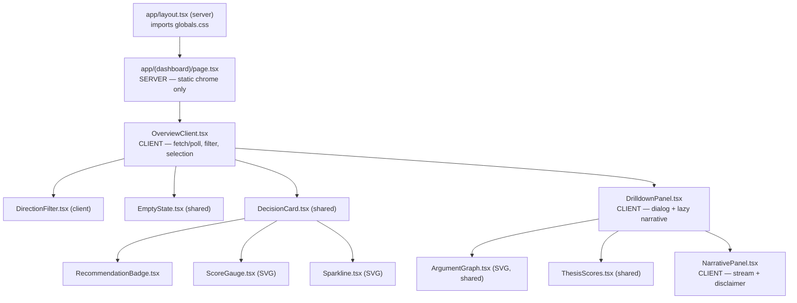
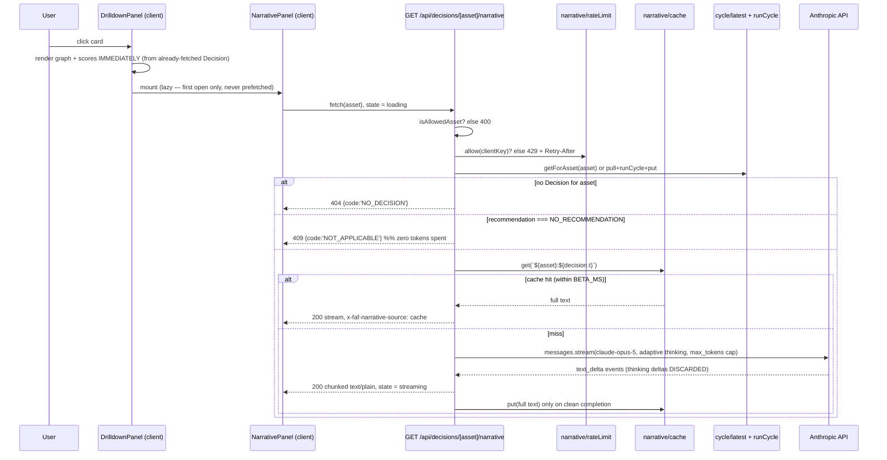
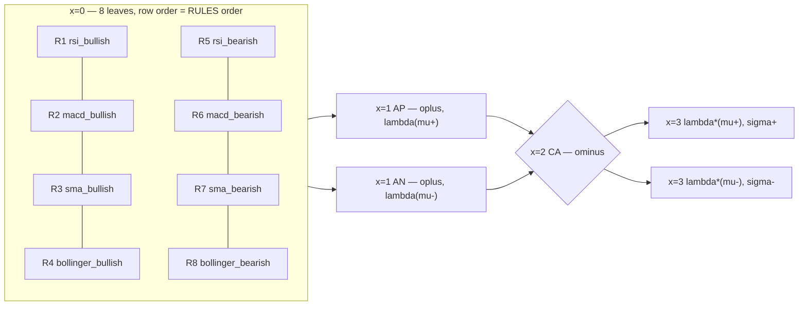

# Design: dashboard-ux — two-tier explainable decision dashboard

> **Addendum status.** This document extends `openspec/changes/archive/2026-08-16-faf-platform/design.md`
> (hereafter *the system design*). Everything there — the L1→L4 layering, the pure-function rule, the
> Vercel deployment model, the cache-sharing caveat, T-1/T-2, and deviations D1–D6 — remains in force
> and is **not** restated here. This change touches only the presentation edge. `src/rdf`, `src/stream`,
> `src/laf`, `src/decision`, and `src/cycle` are **unmodified**.

## Technical Approach

The reasoning core already emits everything Tier 1 and Tier 2 need: `Decision.trace.candles`
(sparkline), `Decision.bullish/bearish.net` (gauge), `Decision.trace.evidences` + `RULES` (graph),
`Decision.thresholds` (θ/δ markers). So this change adds **no new reasoning**, only two new projections
of an existing value plus one new I/O edge (the Claude call).

```
GET /api/decisions ──▶ DecisionReport ──┬──▶ Tier 1  card grid   (deterministic, D3-compliant)
   (unchanged)                          └──▶ Tier 2  drill-down  (graph + scores, D7)
                                                      └──▶ GET /api/decisions/[asset]/narrative
                                                            └──▶ Claude (presentation-only text)
```

Two invariants govern every decision below:

1. **Nothing the LLM returns is ever an input to anything.** The narrative is a leaf of the data flow.
   Removing `ANTHROPIC_API_KEY` must leave `GET /api/decisions` byte-identical.
2. **The UI never fabricates a datum.** Any value shown is read from the `Decision`, or is a pure
   geometric function of one. Where the framework has no value (a non-fired predicate), the UI shows
   *absence*, not `⟨0,0⟩`.

## Component Architecture



**Client/server boundary — the decision.** `page.tsx` becomes a **Server Component** rendering only
static chrome (title, thesis framing, footer); one **client island**, `OverviewClient`, owns the fetch,
the direction filter, the selected asset, and session-only "changed since last poll" state.

- *Rejected: server-fetch the report in `page.tsx` and pass it down.* `/api/decisions` is
  `force-dynamic` and the UI polls; server-rendering the report freezes it at request time and would
  duplicate the read path (RSC fetch **and** client poll) for no benefit. It would also make the
  session-diff state impossible without a second client store.
- *Rejected: keep the whole page `'use client'` (today's shape).* Static chrome then ships as JS for
  no reason, and the copy that carries the thesis framing/AI disclaimer should be server-rendered so
  it is present even if hydration fails — the disclaimer is a correctness requirement, not decoration.
- SVG primitives and pure presentational components carry **no `'use client'` directive**. They are
  imported by client islands (so they land in the client bundle) but stay environment-agnostic, which
  keeps the number of hydration boundaries at three and keeps them renderable from a future server path.

**Geometry lives in pure functions, not in JSX.** `app/(dashboard)/lib/{gauge,sparkline,graphLayout,scores}.ts`
export pure functions returning path strings and coordinate arrays. Strict TDD is active
(`openspec/config.yaml → rules.apply.tdd`), and a RED test asserting an SVG `d` string or a node
coordinate is a real, cheap assertion; a RED test asserting rendered pixels is not. Components become
thin mappers from those values to elements.

**Deleted:** `components/{DecisionTable,AssetFilter,ArgumentTrace}.tsx`.

### Correctness trap — σ MUST be recomputed, never read

`ThesisState.score` is explicitly **not authoritative** (`src/domain/types.ts` lines 71–79: L3's private
`scoreOf` exists only for L3 self-containment and "must never be read by L4 or presentation code").
`app/(dashboard)/lib/scores.ts` therefore wraps the canonical `score()` from `src/decision/policy.ts`
applied to `decision.bullish.net` / `decision.bearish.net`, and **no component may read `.score`**.
θ and δ come from `decision.thresholds`, never from a UI literal.

### Tier 1 selection rule

`selectActionable(report)` = `report.decisions.filter(d => d.recommendation !== 'NO_RECOMMENDATION')`,
then the direction filter (`ALL | BUY | SELL`) over that set. Empty result → `EmptyState`, with two
distinct copies: "no active recommendations right now" (nothing actionable this cycle) vs. "no BUY
recommendations right now" (filter excluded everything) — otherwise the filter looks broken.

## Data Flow — narrative request



## Narrative Endpoint Contract

`app/api/decisions/[asset]/narrative/route.ts` — `runtime='nodejs'`, `dynamic='force-dynamic'`,
`maxDuration=60`, matching both existing routes. **Next 15**: the segment param is a Promise —
`async function GET(_req: Request, { params }: { params: Promise<{ asset: string }> })` — and must be
awaited.

**Request**: `GET`, no body, no query. The only input is the path segment, validated against
`ASSET_ALLOWLIST` via `isAllowedAsset`.

*Decision: the client never sends the trace.* Accepting a client-supplied `Decision` would be one
round-trip cheaper and is **rejected** — it makes the prompt attacker-controlled (T-4) and makes the
cost of a request proportional to attacker-supplied input. The route re-derives the `Decision`
server-side through the same path `GET /api/decisions` uses (`cache.getForAsset` → miss →
`pullAllAssets()` + `runCycle` + `cache.put`), so the narrative is grounded in server-computed data by
construction.

**Success**: `200`, `Content-Type: text/plain; charset=utf-8`, chunked `ReadableStream`, header
`x-faf-narrative-source: llm | cache`.

*Decision: `text/plain` stream, not SSE and not JSON.* The client needs progressive prose and nothing
else; SSE adds event framing with no consumer, and JSON cannot be partially parsed while streaming.
The client reads `response.body.getReader()` + `TextDecoder`. A cache hit is streamed through the same
shape so there is exactly one client code path.

**Failure taxonomy** — JSON `{ error, code }`, and the client branches on `code`, not on status:

| Condition | Status | `code` | LLM called |
|---|---|---|---|
| Symbol not in allowlist / malformed segment | 400 | `BAD_ASSET` | no |
| No `Decision` for the asset this cycle (zero candles) | 404 | `NO_DECISION` | no |
| `recommendation === 'NO_RECOMMENDATION'` | 409 | `NOT_APPLICABLE` | no |
| Rate limit exceeded (+ `Retry-After`) | 429 | `RATE_LIMITED` | no |
| `ANTHROPIC_API_KEY` absent | 503 | `NARRATIVE_DISABLED` | no |
| `RateLimitError` / `APIConnectionError` upstream | 503 | `UPSTREAM_BUSY` | attempted |
| Any other `Anthropic.APIError` | 502 | `UPSTREAM_ERROR` | attempted |
| Unknown throw | 500 | `INTERNAL` | attempted |

Classification uses **typed SDK exceptions** (`instanceof Anthropic.APIError`, `RateLimitError`,
`APIConnectionError`, `APIUserAbortError`) — never message-string matching. Upstream error bodies are
never echoed (T-5); only our mapped `{error, code}` is returned.

**Mid-stream failure.** Once the first byte ships, the status is committed. The route then appends a
single terminator line `\n\n[NARRATIVE_INCOMPLETE]` and closes; the cache is **not** written. The
client treats a stream ending with that marker as `failed-partial`: it keeps the received prose,
appends the degraded notice, and offers retry.

**Client state machine** (`NarrativePanel`): `idle → loading → streaming → done | unavailable | failed`.
`unavailable` = `409 | 503:NARRATIVE_DISABLED` (feature not applicable/not configured — calm copy,
no retry button); `failed` = `502 | 503:UPSTREAM_BUSY | 500 | 429 | failed-partial` (retry offered).
`loading` vs. `streaming` are distinguished by first-byte arrival, so a slow Claude call shows a
skeleton rather than an empty box. In every non-`done` state the graph and scores remain fully
rendered — that is the graceful-degradation guarantee.

### Claude call shape

```ts
// constructed INSIDE the handler, never at module scope, so an absent key
// cannot break import/build (T-5).
const client = new Anthropic();                 // reads ANTHROPIC_API_KEY from env
client.messages.stream({
  model: 'claude-opus-5',
  max_tokens: 2000,                             // hard cap: bounds thinking + output
  thinking: { type: 'adaptive' },               // non-trivial synthesis over the label algebra
  system: NARRATIVE_SYSTEM_PROMPT,              // static constant, zero interpolation
  messages: [{ role: 'user', content: JSON.stringify(buildNarrativeFacts(decision)) }],
});
```

With adaptive thinking, `max_tokens` bounds thinking **plus** visible output, so the cap is set above
the ~180-word target the prompt requests. Only `content_block_delta` events whose delta is a
`text_delta` on a `text` block are forwarded; **thinking deltas are discarded server-side** and never
reach the client.

### Grounding — how the narrative is kept honest

New presentation-layer modules under `src/narrative/` (`facts.ts`, `prompt.ts`, `cache.ts`,
`rateLimit.ts`, `client.ts`). This mirrors the precedent of `src/cycle/latest.ts`: a module that lives
under `src/` but is presentation-only and is **never imported by L1–L4**. Dependency direction is
`narrative → domain/types` and nothing else, so "the core is untouched" stays literally true while the
logic remains unit-testable in Vitest (a route file is awkward to import).

`buildNarrativeFacts(decision)` is a **whitelist projection**, never the raw `Decision`:

```ts
interface NarrativeFacts {
  asset: Asset; at: string;                     // ISO of decision.t
  recommendation: 'BUY' | 'SELL';
  thresholds: { theta: number; delta: number }; // from decision.thresholds
  scores: { sigmaPlus: number; sigmaMinus: number; gap: number };  // via canonical score()
  bullish: ThesisFacts; bearish: ThesisFacts;
}
interface ThesisFacts {
  aggregated: { gamma: number; rho: number };   // lambda(mu)
  net: { gamma: number; rho: number };          // lambda*(mu)
  supporters: Array<{ rule: RuleId; predicate: EvidencePredicate;
                      indicator: WindowSpec['indicator']; omega: number;
                      gamma: number; rho: number; rawValue: number }>;
}
```

`trace.turtle` and `trace.candles` are **excluded** — they are large, they add cost, and the Turtle
serialization would leak the full internal IRI scheme into a third-party prompt for no explanatory gain.

The system prompt (static, golden-snapshot-tested) constrains the model to:
Spanish, ≤180 words, plain prose for a non-technical reader; cite **only** rule IDs and predicates
present in `supporters`; emit **no** number that is not in the payload; **never** mention price targets,
returns, timeframes, external events, or news; **never** issue investment advice beyond restating the
framework's own label; describe the outcome strictly as "σ⁺ vs θ and gap vs δ as computed by the
framework". Anti-hallucination rests on structure, not on trust: **every byte of the prompt is either
a static constant or a server-derived value from a closed enumeration** — there is no free-text field
anywhere in it (the only string, `asset`, comes from a 3-element allowlist).

Verification is necessarily indirect (model output is non-deterministic, and no live network runs in
CI — same convention as the Binance cassettes): assert the *pure* parts — `buildNarrativeFacts` output
shape/snapshot, prompt-assembly golden, stream-delta mapping and the full error table against a mocked
SDK.

### Caching

`src/narrative/cache.ts` mirrors `src/cycle/latest.ts`'s shape: module-scope `Map`, key
`` `${asset}:${decision.t}` ``, TTL `BETA_MS` (`src/cycle/constants.ts`), bounded to 16 entries with
oldest-eviction so a long-lived instance cannot grow unbounded. `decision.t` is derived from the data,
not the wall clock (`runCycle`'s `latestTimestamp`), so the key is deterministic and a recomputed
identical report reuses the same narrative. Only a **cleanly completed** narrative is stored.

**Same caveat as the system design's "Cache sharing in the stated Vercel deployment" section, and it
matters more here.** This is a module-scope variable; on Vercel it is per-instance, so a second
drill-down on the same asset frequently lands on a cold instance and pays for a second generation.
The cache is a cost *reduction*, never a cost *ceiling*, and MUST NOT be counted as the abuse control.

## SVG Argumentation Graph

The topology is fixed and known statically from `RULES` (`src/laf/rules.ts`), so layout is a pure
function of the rule table plus the fired evidence set — **no layout engine at runtime**
(d3/dagre/mermaid rejected: a ~100 kB dependency to lay out 13 nodes whose positions never change).



`layoutArgumentGraph(evidences)` in `app/(dashboard)/lib/graphLayout.ts` returns typed node/edge arrays:

- **Column 0** — all 8 leaves at `y = i * ROW_H`, iteration order taken directly from `RULES`, so the
  diagram cannot drift from L3's own rule table.
- **Column 1** — `AP` at the centroid of rows R1–R4, `AN` at the centroid of R5–R8.
- **Column 2** — `CA` centered between them. **Column 3** — the two net-label outputs.
- Fixed `viewBox="0 0 720 380"` + `preserveAspectRatio`, scaled by CSS. No JS measurement, therefore
  no hydration mismatch and identical output in any environment.

**Fired vs. non-fired — the backend-gap answer.** `evaluateGraph` only ever receives fired evidences,
and `Decision.trace.evidences` is exactly that set; the framework has *no label at all* for a
non-fired predicate. The UI still renders all 8 leaves, because the topology is a static property of
`RULES`, not of the cycle — but the two classes are strictly separated:

| Leaf class | Derivation | Rendering | Shows ⟨γ,ρ⟩ |
|---|---|---|---|
| Fired | present in `trace.evidences` | solid node, thesis-colored; edge stroke-width ∝ γ, opacity ∝ (1−ρ) | **yes**, from the evidence |
| Non-fired | `RULES` predicate absent from `trace.evidences` | dashed muted outline, label "no activada en este ciclo" | **no — never `⟨0,0⟩`** |

Rendering `⟨0,0⟩` for a non-fired leaf would invent a datum the framework never produced, and would
visually contradict `oplus([]) = ⟨0,0⟩`'s *distinct* meaning (an empty supporter set). This respects
the proposal's non-goal "emitting inactive/neutral predicates": **nothing new is emitted** — the UI
derives absence by set difference against a table it already imports.

RA/CA/net nodes render `aggregated`, the ⊖ operator, and `net` + σ with a θ tick; the side matching
`decision.recommendation` is highlighted. `<svg role="img">` with `<title>`/`<desc>`, and every node
carries `data-testid="graph-node-R1"` + `data-state="fired|inactive"` so the rewritten Playwright suite
asserts structure without pixel comparison.

**Gauge**: semicircular arc, two needles (σ⁺, σ⁻) plus a θ tick read from `decision.thresholds.theta`.
**Sparkline**: `sparklinePath(closes, w, h)` over `trace.candles` closes with min/max normalization, a
flat-series guard (`max === min` → mid-line, no division by zero — same guard discipline as
`confidence.ts`'s `sigma_H === 0`), plus a last-close marker.

## Tailwind Adoption

**Tailwind v4**, CSS-first. `package.json` gains `tailwindcss@^4` + `@tailwindcss/postcss`
(devDependencies) and `@anthropic-ai/sdk` (dependency); `postcss.config.mjs` is new; `app/globals.css`
is new (`@import "tailwindcss";` + a `@theme` token block) and is imported once by `app/layout.tsx`.

- **No `tailwind.config.js`.** v4 is CSS-first with automatic content detection; a config file would be
  dead weight. This refines the proposal's v3-era "(+ PostCSS/Autoprefixer)" phrasing — **autoprefixer
  and postcss-import are not installed**, because v4 handles both internally via Lightning CSS. Same
  decision (Tailwind), fewer packages.
- **Dark theme only, no toggle.** The deliverable is a projected thesis demo; a toggle doubles visual
  QA surface, needs persistence, and introduces a first-paint theme flash — all cost, zero defense
  value. Fixed tokens in `@theme`; light mode is a post-thesis change. *Rejected: `dark:` variant pairs
  throughout* (doubles class surface for a mode nobody will demo).
- Semantic tokens `--color-buy`, `--color-sell`, `--color-inactive`, `--color-muted` are consumed by
  both the cards and the SVG components (via `currentColor`/`var()`), so the gauge, sparkline, and
  graph share one palette instead of hardcoding hex values in three files.

## Threat Matrix Addendum

The skill's shell/VCS matrix is **N/A** in full: this change adds no shell command, subprocess, git or
PR automation, and no executable-file classification — its only new boundary is one HTTP route. Rows
`Documentation-like paths`, `Git repository selection`, `Commit state`, `Push state`, and `PR commands`
are therefore each `N/A: no shell/VCS/process boundary in this change`. The project's own T-N
convention continues from the system design's T-1/T-2:

- **T-3 LLM cost abuse on a public endpoint.** Layered, cheapest first: allowlist rejection (400)
  before any client construction; 404/409 short-circuits that spend zero tokens; per-instance
  fixed-window rate limit (10 req / 60 s per client key from `x-forwarded-for`, plus a global
  per-instance hourly circuit breaker) in `src/narrative/rateLimit.ts`; `max_tokens` cap; the β-window
  `(asset, t)` cache; and — the only *hard* ceiling — a spend cap configured on the Anthropic key
  itself, documented in `.env.example`. **Honest limitation**: the rate limiter is module-scope and
  therefore per-instance, exactly like `latest.ts`'s cache, so a distributed attacker multiplies the
  effective limit by the number of instances Vercel spawns. It bounds accidental and casual abuse, not
  a determined adversary. *Rejected for v1: Upstash/Vercel KV.* It would be a genuine fix, and
  `rateLimit.ts` is deliberately the single seam where it drops in, but it adds the project's first
  external store and a new deployment/failure surface for a closed-audience thesis demo; the console
  spend cap gives the hard ceiling at zero architectural cost. Revisit if the URL is ever published.
  *RED tests*: disallowed symbol → 400 with no Anthropic client constructed; `NO_RECOMMENDATION` asset
  → 409 with no API call; request N+1 in the window → 429 with `Retry-After`; second request for the
  same `(asset, t)` → served from cache with exactly one upstream call total.
- **T-4 Prompt injection / trace exfiltration.** No client-authored text reaches the prompt; the asset
  comes from a 3-element allowlist; the payload is a whitelist projection excluding `trace.turtle` and
  `trace.candles`; the route ignores body and query entirely. *RED tests*: `buildNarrativeFacts`
  snapshot contains no `turtle`/`candles`/unlisted keys; a request carrying a crafted body/query
  produces a byte-identical prompt.
- **T-5 API key handling.** `ANTHROPIC_API_KEY` is read only inside a `runtime='nodejs'` handler, is
  never `NEXT_PUBLIC_`-prefixed, and `src/narrative/client.ts` is never imported by any `'use client'`
  module. The client is constructed inside the handler, so an absent key yields `503
  NARRATIVE_DISABLED` instead of an import-time crash. Upstream error payloads are never echoed.
  *RED tests*: an `APIError` whose message embeds a secret-shaped string is not present in the response
  body; a static-import assertion that no client-boundary module reaches `src/narrative/client.ts`.
- **T-6 Serverless timeout / hung upstream.** Streaming plus `maxDuration=60` plus an `AbortController`
  with a 45 s deadline; on abort the stream is terminated with `[NARRATIVE_INCOMPLETE]` and the cache
  is not written. *RED test*: a mocked never-yielding stream aborts deterministically and closes with
  the marker.

## Deviation D7 (proposed): LLM narrative and argument graph admitted, drill-down only — narrows D3

**What the PRD (D3) says**: the LLM narrative and the argumentative graph are deferred to v2; v1 ships
the decision and its trace as JSON/table only.

**What changes**: both are admitted **exclusively inside the Tier 2 per-asset drill-down**. D3 remains
in force everywhere else, unchanged.

**Why**: the v1 UI is undeployable as a thesis artifact ("sumamente deficiente"), and explainability is
this thesis's central claim — a framework that computes an explanation but cannot show it argues
against itself under committee scrutiny. Crucially, the deferral's original *cost* justification no
longer applies to the graph: `Decision.trace.evidences` + the static `RULES` table already contain the
entire topology, so the graph is a pure rendering of data v1 already produces. Only the narrative adds
a genuinely new dependency, and it is confined behind a user-initiated click.

**Explicit boundary** (each clause is independently testable):

1. Tier 1 renders **zero** LLM text and **zero** node-edge graph — it stays wholly inside D3's line.
2. No σ, λ, ⟨γ,ρ⟩, gap, or `Recommendation` value is ever LLM-derived. The model receives them as
   given facts and may only restate them; it is structurally incapable of writing back.
3. The narrative is generated **lazily on drill-down open**, never prefetched, never on page load.
4. Narrative absence never changes a decision: `GET /api/decisions` output is byte-identical with and
   without `ANTHROPIC_API_KEY`.
5. The narrative is visibly and permanently labeled as AI-generated, typographically distinct from the
   deterministic σ/λ values it accompanies.
6. `src/{rdf,stream,laf,decision,cycle}/` are unmodified; `src/narrative/` is presentation-only and is
   imported by no L1–L4 module.

**Verification**: e2e asserts no narrative/graph test IDs exist on the Tier 1 view (clause 1) and that
the drill-down still renders graph + scores when the narrative route returns 503 (clause 4, mocked);
a unit test asserts `GET /api/decisions` output equality across key-present/key-absent environments
(clause 4); `buildNarrativeFacts` is proven to be a read-only projection (clauses 2, 6); a static-import
test proves no L1–L4 module reaches `src/narrative/` (clause 6); e2e asserts the disclaimer element is
present whenever narrative text is (clause 5). D7 is recorded in `docs/PRD.md` and encoded in the
`decision-dashboard` spec delta.

## File Changes

| File | Action | Description |
|---|---|---|
| `app/globals.css`, `postcss.config.mjs` | Create | Tailwind v4 entry + `@theme` tokens |
| `app/layout.tsx` | Modify | Import `globals.css`; dark base classes |
| `app/(dashboard)/page.tsx` | Rewrite | Server Component: static chrome + `<OverviewClient/>` |
| `app/(dashboard)/components/OverviewClient.tsx` | Create | Client island: fetch/poll, filter, selection |
| `app/(dashboard)/components/{DecisionCard,RecommendationBadge,ScoreGauge,Sparkline,DirectionFilter,EmptyState}.tsx` | Create | Tier 1 |
| `app/(dashboard)/components/{DrilldownPanel,ArgumentGraph,ThesisScores,NarrativePanel}.tsx` | Create | Tier 2 |
| `app/(dashboard)/lib/{gauge,sparkline,graphLayout,scores,select}.ts` | Create | Pure geometry/selection functions |
| `app/(dashboard)/components/{DecisionTable,AssetFilter,ArgumentTrace}.tsx` | Delete | Superseded |
| `app/api/decisions/[asset]/narrative/route.ts` | Create | Streaming narrative endpoint |
| `src/narrative/{facts,prompt,cache,rateLimit,client}.ts` | Create | Presentation-only, outside L1–L4 |
| `package.json` | Modify | `+@anthropic-ai/sdk`, `+tailwindcss@^4`, `+@tailwindcss/postcss` |
| `.env.example` | Modify | `ANTHROPIC_API_KEY` + spend-cap note |
| `tests/e2e/dashboard.spec.ts` | Rewrite | Coupled to deleted table markup |
| `docs/PRD.md`, `openspec/specs/decision-dashboard/spec.md` | Modify | D7 |
| `src/{rdf,stream,laf,decision,cycle}/**` | **Unchanged** | Reasoning core untouched |

## Testing Strategy

| Layer | What | Approach |
|---|---|---|
| Unit — geometry | `gauge`, `sparkline`, `graphLayout` | Assert path `d` strings and node coordinates; flat-series and empty-candles guards; all-8-leaf presence with correct `fired`/`inactive` partition |
| Unit — selection | `selectActionable`, direction filter | Table test over BUY/SELL/NO_RECOMMENDATION mixes, incl. all-`NO_RECOMMENDATION` |
| Unit — narrative core | `facts`, `prompt`, `cache`, `rateLimit` | Projection snapshot (T-4), prompt golden, β-TTL + eviction + `(asset,t)` keying, window/limit boundaries |
| Integration — route | narrative route | Mocked `@anthropic-ai/sdk`: full failure table, typed-exception mapping, stream-delta forwarding, thinking-delta suppression, cache hit ⇒ one upstream call, abort ⇒ `[NARRATIVE_INCOMPLETE]` |
| Integration — invariance | `/api/decisions` | Byte-identical with and without `ANTHROPIC_API_KEY` (D7 clause 4) |
| E2E | dashboard | Card grid renders only actionable assets; empty state; direction filter; drill-down shows graph + scores; narrative disclaimer present with text; degraded path with a stubbed 503 |

No live Anthropic call runs in CI — same convention as the Binance cassettes in the system design.

## Migration / Rollout

No migration; no schema or persisted state. `git revert` is complete rollback. Per-slice: unsetting
`ANTHROPIC_API_KEY` disables the narrative in production without a deploy (drill-down degrades to
graph + scores); Tailwind reverts by dropping the `globals.css` import and the two dev dependencies.

## Review-Budget Risk (flagged, not finalized — `sdd-tasks` owns the forecast)

The proposal already rates this **High** against the 800-line budget, and this design does not shrink
it: the pure-function extraction adds files (though each is small and heavily unit-tested, which is what
strict TDD wants). The proposal's 4-slice chain remains the right shape, with two design-driven notes:

1. **Slice 1 (Tailwind + Tier 1) must land first** — every later slice's markup depends on the token
   layer; splitting tokens from Tier 1 would produce an unreviewable stylesheet with no consumer.
2. **Slice 2 (narrative route) is larger than "one route"** — it also carries five `src/narrative/*`
   modules, the T-3/T-4/T-5/T-6 RED tests, `.env.example`, and the D7 doc/spec delta (slice 2 is the
   first slice to cross the D3 line). If `sdd-tasks`' forecast puts it over budget, the natural cut is
   **2a** = pure modules (`facts`, `prompt`, `cache`, `rateLimit`) with full unit coverage and no
   network, **2b** = the route, streaming, error mapping, and D7 docs.
3. **Slice 4 (e2e rewrite) must chain last** — its assertions target markup that only exists after
   slice 3, so it cannot be verified earlier.

Nothing else in this design changes the proposed chaining shape.

## Open Questions

- [ ] Rate-limit numbers (10/60 s per key, hourly instance cap) are a first estimate; the Anthropic
      console spend cap is the real ceiling. Not blocking — tunable constants in one file.
- [ ] `max_tokens: 2000` with adaptive thinking is sized for a ~180-word Spanish narrative plus
      thinking headroom; may need one empirical adjustment after the first real call. Not blocking.
